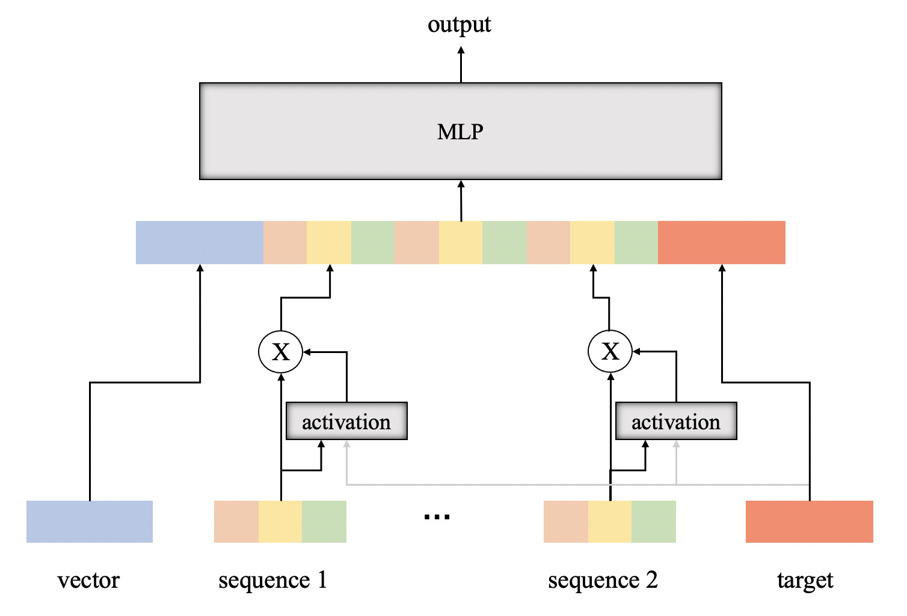

# Configurable Tensorflow DIN

## DIN
This project is a tensorflow implementation of DIN 
([Deep Interest Network for Click-Through Rate Prediction](https://arxiv.org/abs/1706.06978))

We abstract DIN into the following structure:


- **vector:** directly fed into the MLP, e.g., user profile
- **sequence:** sequential values that will be attentioned, e.g., history click sequence.
    There can be multiple sequences, e.g., purchasing history and browsing history.
- **target:** target value that will be directly fed into the MLP of DIN, and applies attention to the sequence inputs, 
    e.g., target page
    
Each input value can come in two ways:
- **value:** continuous input values, e.g., time spent on a page
- **embedding:** discrete input values which will be passed into an embedding layer, e.g., page name

Therefore, we classify the model inputs into 6 categories: 
emb_vec, emb_seq, emb_tgt, val_vec, val_seq, val_tgt.
We implement DIN based on such abstract, independent with specific model inputs.
Pass a config dict to the model ([example](scripts/data/fea_config.py)), 
and the model can construct the computation graph automatically.

## Usage
### Fast Run
1. Run data/generate_samples.py to generate demo samples:
    ```shell script
    python data/generate_samples.py
    ```
2. Create config.py under scrips/ to specify your project absolute path, e.g.,
    ```python
    project_fd = '/root/din/'
    ```
3. Run scripts/train_din.py to start the training process:
    ```shell script
    python scripts/train_din.py
    ```
   
### Details
- If you have a customized dataset, modify [common.py](scripts/common.py),
  specify:
  ```python
  train_data_fp = "path/to/trainset/file"
  test_data_fp = "path/to/testset/file"
  ```
- If need a customized dataset with customized model structure, modify [fea_config.py](scripts/data/fea_config.py), 
  and write a *FEA_CONFIG* dict and *SHARED_EMB_CONFIG* dict.

## Code Structure

```shell
scripts
├── common.py: global configuration
├── config.py: global configuration
├── data: data reading module
│   ├── dataset.py: object to read, shuffle, and preprocess data
│   └── fea_config.py: configuration for preprocess and model construction
├── model
│   ├── din.py: DIN object
│   ├── layers
│   │   ├── activation.py: activation layers (PReLU and Dice)
│   │   ├── attention.py: attention layers
│   │   ├── forward_net.py: MLP layers
│   │   └── interface.py: abstract class for layers
│   └── utils
│       ├── constant.py: constants
│       ├── input_fn.py: wrapper for estimator training
│       ├── proc_input_config.py: utils function
│       └── widgets.py: utils function
├── train
│   ├── evaluate.py: evaluation code
│   ├── metrics.py: evaluation metrics
│   └── vanilla_train.py: training code
└── train_din.py: entry file
```

## Key Methods
The Din class defined in [din.py](scripts/model/din.py) has the following functions:
- build_graph_: build computation graph, and store the input and output nodes as attributes
  - attributes:
    - features_ph, labels_ph: input nodes
    - outputs: output nodes
    - session, graph: computation graph
    - saver: checkpoint saver
  - relevant methods:
    - switch_graph: switch to your specified graph if multiple graph exists
    - load_from: load the variable values from a target graph
- model_fn: for estimator invocation
- freeze: set trainable=False for variables (invoke before build_graph please)
